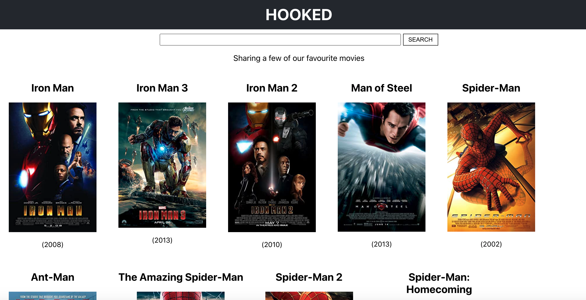
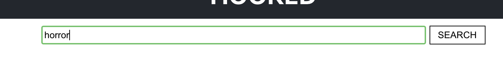
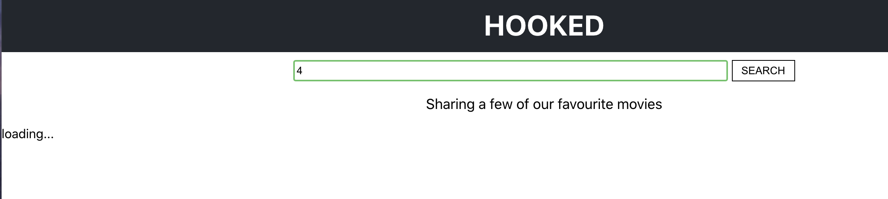
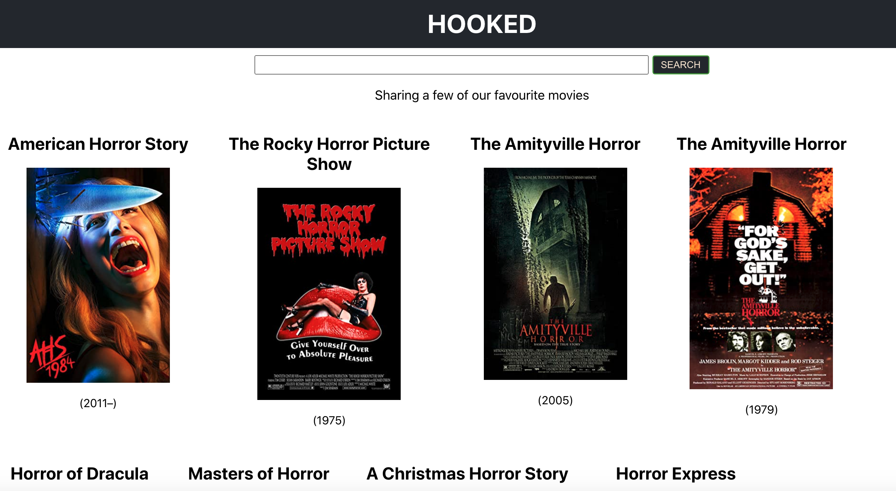

# Hooked
## About
    

# How to Use Budget-Tracker:
*The main page will display some movies and a search bar  
   
 In the seach bar type a key word or movie title  
   
 While the results are loading the page will display "loading.."  
   
 Finally the results of the search as rendered to the page  
   

# Access the app here: 
* Github: https://github.com/karleighponnock/Burger-App
* Heroku Deployed: https://protected-tor-91451.herokuapp.com/

# Credits
Free Code Camp Front End Projects to know in 2020 by Samuel Omole
https://www.freecodecamp.org/news/how-to-build-a-movie-search-app-using-react-hooks-24eb72ddfaf7/

# Author
 * Karleigh Ponnock
* Github: https://github.com/karleighponnock?tab=repositories
* Linkedin: https://www.linkedin.com/in/karleigh-ponnock-3601421aa/
* Profile: https://karleighponnock.github.io/New-Responsive-Portfolio/
